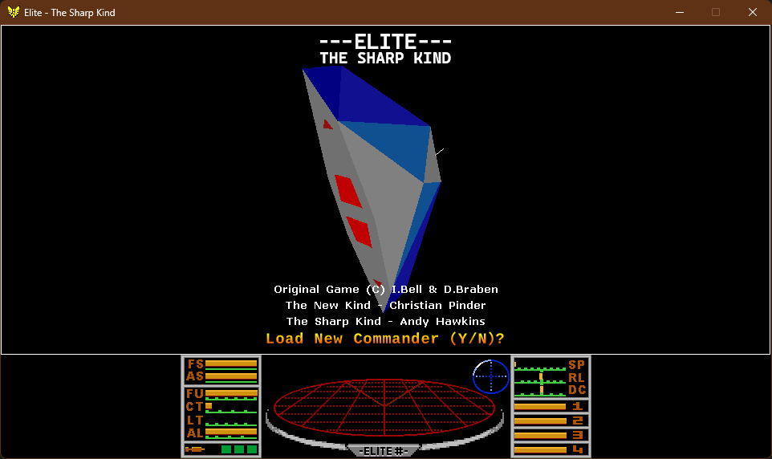

# The Sharp Kind

Classic 8/16-bit computer games re-engineered in C# / .NET, sharing a common set of `Useful.*` game-engine libraries. The games are meant to look, feel and play like the originals while running cross-platform on modern hardware.

| Game | Status | Details |
| --- | --- | --- |
|  | | |
| **Elite - The Sharp Kind** | Playable, feature-complete | [Elite readme](docs/elite-readme.md) |
| **Stunt Car Racer - The Sharp Kind** | In development | [Stunt Car Racer readme](docs/scr-readme.md) |

## Getting started

Requires the [.NET SDK](https://dotnet.microsoft.com/download) (see `Directory.Build.props` for the target framework version).

```bash
# Elite
dotnet run --project src/elite/apps/EliteSharp

# Stunt Car Racer
dotnet run --project src/scr/apps/StuntCarRacer
```

Tested platforms: Windows (x64), Ubuntu (x64), Raspberry Pi 4 (ARM64). On Linux the SDL2 libraries need to be installed first — see the [Elite readme](docs/elite-readme.md#sdl---development-setup).

## Repository layout

- `src/useful/` — shared engine libraries (graphics, audio, input, assets, game loop) used by both games
- `src/elite/` — Elite: game library, app, tests, benchmarks
- `src/scr/` — Stunt Car Racer: game library, app, tests
- `docs/` — per-game readmes and project documentation

## Documentation

- [Architecture principles](docs/architecture.md)
- [Backlog and roadmap](docs/backlog-roadmap.md) — the single consolidated backlog
- [Changelog](CHANGELOG.md)
- [Contributing](CONTRIBUTING.md)

## Licence

[MIT](LICENSE). Original game copyrights remain with their respective owners — see each game's readme for credits.
