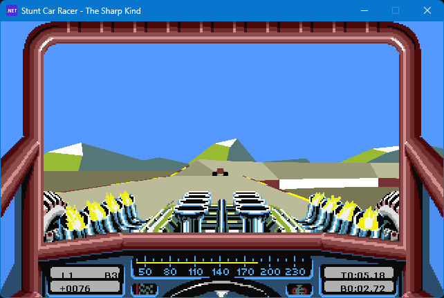

# The Sharp Kind


Classic 8/16-bit computer games re-engineered in C# / .NET, sharing a common set of `Useful.*` game-engine libraries. The games are meant to look, feel and play like the originals while running cross-platform on modern hardware.

## Games

### [Elite - The Sharp Kind](docs/elite-readme.md)


Status: Playable, feature-complete.

### [Stunt Car Racer - The Sharp Kind](docs/scr-readme.md)



Status: Playable, preview.

## Getting started

Requires the [.NET SDK](https://dotnet.microsoft.com/download) (see `Directory.Build.props` for the target framework version).

```bash
# Elite
dotnet run --project src/elite/apps/EliteSharp

# Stunt Car Racer
dotnet run --project src/scr/apps/StuntCarRacerSharp
```

Both games can also be run and debugged directly from an IDE: open [TheSharpKind.slnx](TheSharpKind.slnx) in Visual Studio and set `EliteSharp` or `StuntCarRacerSharp` as the startup project, or open the repo root in VS Code and use the "Elite" / "Stunt Car Racer" launch configurations (`.vscode/launch.json`).

Tested platforms: Windows (x64), Ubuntu (x64), Raspberry Pi 4 (ARM64).

## SDL - Development Setup

Both games can be developed using either Visual Studio 2026 or VSCode.
For all platforms, ensure that the dotnet SDK is installed.
Start the `EliteSharp` or `StuntCarRacerSharp` project, which support most platforms, to get straight into the game.

The SDL3, SDL3_ttf and SDL3_mixer native libraries ship inside their respective NuGet packages (win-x64, linux-x64 and linux-arm64), so no manual install step is required on any platform — `dotnet run` or `dotnet build` is enough.

## Configuration

Each game keeps its settings in a JSON file in the shared per-user data directory (`%AppData%\The Sharp Kind` on Windows, `~/.config/The Sharp Kind` on Linux/macOS) — `elite.sharp` and `stuntcarracer.sharp`. Saves and logs live in the same place. The file is written with defaults on first run, and if it is missing or invalid the game falls back to defaults rather than refusing to start.

Every file has the same three top-level elements: `version`, the schema version; `engine`, the settings shared by all the games, documented here; and `game`, that game's own, documented in its readme ([Elite](docs/elite-readme.md#configuration), [Stunt Car Racer](docs/scr-readme.md#configuration)).

`engine` groups its graphics and sound settings; what's left at the top spans both.

``` json
{
    "version": 1,                              // Schema version, so a later change to the file's shape can be migrated rather than reset.  Written automatically
    "engine": {
        "backend": "Software",                 // Which backend runs the game.  Software (CPU rasteriser blitted through SDL) or Hardware (SDL-accelerated).  It picks the mixer as well as the rasteriser, so it isn't graphics-only
        "tier": "SixteenBit",                  // Which machine's look the game reproduces.  EightBit or SixteenBit.  Picks the asset set - artwork, fonts, music and effects - and with it the render resolution.  See docs/asset-structure.md
        "windowScale": 1,                      // How many window pixels each rendered pixel occupies, 1 to 4.  Independent of the tier: the game still renders at the tier's native resolution and is magnified at presentation, so scale 2 is a window twice the size with the same pixels doubled, not more detail
        "graphics": {
            "fps": 60,                         // Maximum render frame rate, up to 1000.  The game speed is independent of it
            "graphicStyle": "Solid",           // How the 3D world is drawn - every object together, so it can't end up half one and half the other.  Wireframe or Solid
            "depthSort": "ZBuffer",            // Depth-sort strategy for filled rendering (ignored when graphicStyle is Wireframe).  Painter or ZBuffer
            "showFps": false                   // Overlay the measured frame rate.  A diagnostic, so off by default
        },
        "sound": {
            "music": true,                     // Play music
            "effects": true                    // Play sound effects
        },
        "logging": {
            "minimumLevel": "Information",     // Lowest level written to the log file and console.  Trace, Debug, Information, Warning, Error, Critical or None.  The ELITE_LOG_LEVEL / SCR_LOG_LEVEL environment variables override this, for when the config file itself is what needs debugging
            "retainedFileCount": 7             // How many rolling daily log files are kept, 1 to 366, before the oldest are deleted
        }
    }
}
```

Property names are read case-insensitively, so a hand-edited file in any casing still binds; they are written back in camelCase. Comments and trailing commas are tolerated when reading, but are not preserved when the game writes the file back.

### When a setting can't be honoured

A value that is out of range or unrecognised costs you that setting and nothing else: it goes back to its default, the rest of the file is kept, and the file as it was is copied alongside as `elite.sharp.bad` (or `stuntcarracer.sharp.bad`) so the original is still recoverable by hand.

The exception is a value the JSON binder cannot parse at all — a misspelt enum name, or a string where a number belongs. That fails the whole file, so every setting returns to its default; the `.bad` copy is what makes it recoverable.

Note that Stunt Car Racer doesn't read `graphicStyle`, `depthSort` or `showFps` yet — they are written out with the rest of the engine settings, but only Elite acts on them.

## Repository layout

- `src/useful/` — shared engine libraries (graphics, audio, input, assets, game loop) used by both games
- `src/elite/` — Elite: game library, app, tests, benchmarks
- `src/scr/` — Stunt Car Racer: game library, app, tests
- `docs/` — per-game readmes and project documentation

## Documentation

- [Architecture principles](docs/architecture-principles.md)
- [Backlog — issues](docs/backlog-issues.md) — open defects, fixed first
- [Backlog and roadmap](docs/backlog-roadmap.md) — features, refactors and spikes
- [Changelog](CHANGELOG.md)
- [Contributing](CONTRIBUTING.md)

## Licence

[MIT](LICENSE). Original game copyrights remain with their respective owners — see each game's readme for credits.
