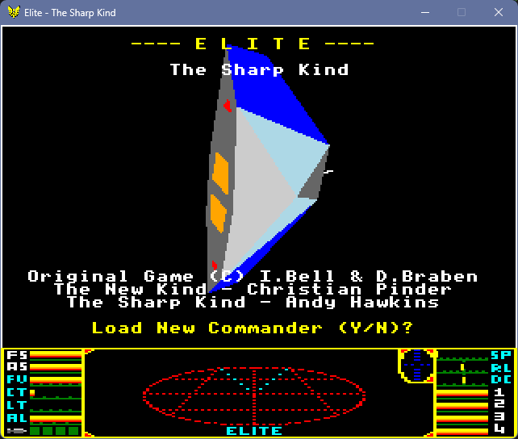

# The Sharp Kind

[](https://github.com/aphawkins/the-sharp-kind/actions/workflows/build-and-package.yml)

[](https://github.com/aphawkins/the-sharp-kind/releases/latest)
[](LICENSE)

Classic 8/16-bit computer games re-engineered in C# / .NET, sharing a common set of `SharpKind.*` game-engine libraries. The games are meant to look, feel and play like the originals while running cross-platform on modern hardware.

[Project site](https://aphawkins.github.io/the-sharp-kind/)

## Games

### [Elite - The Sharp Kind](docs/elite-readme.md)



Status: Playable, feature-complete.

### [Stunt Car Racer - The Sharp Kind](docs/scr-readme.md)


Status: Playable, preview.

## Getting started

Requires the [.NET SDK](https://dotnet.microsoft.com/download) (see `Directory.Build.props` for the target framework version).

```bash
# Elite
dotnet run --project src/elite/apps/EliteSharp

# Stunt Car Racer
dotnet run --project src/scr/apps/StuntCarRacerSharp

# Control gallery — every shared UI control, for looking at
dotnet run --project src/useful/apps/SharpKind.UI.Gallery
```

Both games can also be run and debugged directly from an IDE: open [TheSharpKind.slnx](TheSharpKind.slnx) in Visual Studio and set `EliteSharp` or `StuntCarRacerSharp` as the startup project, or open the repo root in VS Code and use the "Elite" / "Stunt Car Racer" launch configurations (`.vscode/launch.json`).

Tested platforms: Windows (x64), Ubuntu (x64), Raspberry Pi 4 (ARM64).

## SDL - Development Setup

Both games can be developed using either Visual Studio 2026 or VSCode.
For all platforms, ensure that the dotnet SDK is installed.
Start the `EliteSharp` or `StuntCarRacerSharp` project, which support most platforms, to get straight into the game.

The SDL3, SDL3_ttf and SDL3_mixer native libraries ship inside their respective NuGet packages (win-x64, linux-x64 and linux-arm64), so no manual install step is required on any platform — `dotnet run` or `dotnet build` is enough.

## Configuration

Each game keeps its settings in a JSON file in the shared per-user data directory (`%AppData%\The Sharp Kind` on Windows, `~/.config/The Sharp Kind` on Linux/macOS) — `elite.sharp` and `stuntcarracer.sharp`. Saves and logs live in the same place. The file is written with defaults on first run, and if it is missing or invalid the game falls back to defaults rather than refusing to start.

Every file has the same three top-level elements: `version`, the schema version; `engine`, the settings shared by all the games, documented here; and `game`, that game's own, documented in its readme ([Elite](docs/elite-readme.md#configuration), [Stunt Car Racer](docs/scr-readme.md#configuration)).

`engine` groups its graphics and sound settings; what's left at the top spans both.

``` json
{
    "version": 1,                              // Schema version, so a later change to the file's shape can be migrated rather than reset.  Written automatically
    "engine": {
        "backend": "Software",                 // Which backend runs the game.  Software (CPU rasteriser blitted through SDL) or Hardware (SDL-accelerated).  It picks the mixer as well as the rasteriser, so it isn't graphics-only
        "rendition": "16-bit",                 // Which rendition the game draws itself as.  Any installed one - "8-bit" and "16-bit" ship with it, named as they name themselves.  A rendition brings its own artwork, fonts, palette and models, and its own resolution.  See below, and docs/asset-structure.md
        "windowScale": 2,                      // How many window pixels each rendered pixel occupies.  The game still renders at the rendition's own resolution and is magnified at presentation, so scale 2 is a window twice the size with the same pixels doubled, not more detail.  Which scales are on offer is the rendition's own (see below); omit it and the rendition's default is used
        "graphics": {
            "fps": 60,                         // Maximum render frame rate, up to 1000.  The game speed is independent of it
            "fillMode": "Solid",               // How a primitive becomes pixels - every object together, so it can't end up half one and half the other.  Wireframe or Solid
            "depthSort": "ZBuffer",            // Depth-sort strategy for filled rendering (ignored when fillMode is Wireframe).  Painter or ZBuffer
            "shading": "Unlit",                // What colour a face takes (ignored when fillMode is Wireframe, or in a rendition that does not shade).  Unlit (the model's flat colour), Lambert (one tone per face, from the angle it faces the light) or Gouraud (the tone blended across the face, from its corners)
            "quantisation": "Nearest",         // How a shaded colour is reduced to one the rendition can show.  Nearest, or Ordered to dither between the two either side of it
            "fontKind": "Bitmap",              // Which kind of font text is drawn with.  Bitmap (the rendition's own sheets), Fon (a Windows .fon) or TrueType.  Both backends honour it, so it decides how text looks rather than which machine is drawing it; a rendition declaring no font of the chosen kind draws with its own sheets.  Which kinds a rendition offers is its own (see below)
            "showFps": false                   // Overlay the measured frame rate.  A diagnostic, so off by default
        },
        "sound": {
            "music": true,                     // Play music
            "effects": true                    // Play sound effects
        },
        "logging": {
            "minimumLevel": "Information",     // Lowest level written to the log file and console.  Trace, Debug, Information, Warning, Error, Critical or None.  The ELITE_LOG_LEVEL / SCR_LOG_LEVEL environment variables override this, for when the config file itself is what needs debugging
            "retainedFileCount": 7             // How many rolling daily log files are kept, 1 to 366, before the oldest are deleted
        }
    }
}
```

Property names are read case-insensitively, so a hand-edited file in any casing still binds; they are written back in camelCase. Comments and trailing commas are tolerated when reading, but are not preserved when the game writes the file back.

### When a setting can't be honoured

A value that is out of range or unrecognised costs you that setting and nothing else: it goes back to its default, the rest of the file is kept, and the file as it was is copied alongside as `elite.sharp.bad` (or `stuntcarracer.sharp.bad`) so the original is still recoverable by hand.

`windowScale` is the one that bends rather than breaks: a scale the chosen rendition does not offer is pegged to the nearest one it does (ties going to the larger), so asking the `8-bit` rendition for 3 opens at 4 rather than falling back to 1. Which scales exist is the rendition's answer, not the file's, so this is settled once the rendition has been loaded.

The exception is a value the JSON binder cannot parse at all — a misspelt enum name, or a string where a number belongs. That fails the whole file, so every setting returns to its default; the `.bad` copy is what makes it recoverable.

Note that Stunt Car Racer doesn't read `fillMode`, `depthSort`, `shading`, `quantisation` or `showFps` yet — they are written out with the rest of the engine settings, but only Elite acts on them.

### What a rendition limits

A rendition stands in for a class of machine, so it carries that machine's limits rather than just its artwork. They are deliberate, and they are checked: an asset set that breaks one fails at load with a `SharpKindException` naming the rendition and the assets at fault, rather than being quietly tolerated. The limits a rendition declares for itself live in the `Colours` element of its `AssetManifest.json`.

| | `8-bit` | `16-bit` |
| --- | --- | --- |
| Render resolution (Elite) | 320 x 256 | 640 x 512 |
| Max colours | 16 | 4096 |
| Palette is the complete colour set | yes — an asset may only use colours the palette names | no — the palette only names the colours the geometry draws with |
| Fonts (`fontKind`) | `Bitmap` an 8 x 8 fixed grid sheet, and a `.fon` and TrueType face of the same 8 px character ROM | `Bitmap` a proportional sheet of 32 x 32 cells, and OpenSans as a TrueType face — no `.fon` |
| Shading | yes, to the nearest colour the palette names | yes, to the nearest level the DAC drives |
| Window scales (`windowScale`) | 1, 2 or 4 — default 4 | 1 or 2 — default 2 |

### Environment variables

Diagnostic opt-ins read at runtime rather than compiled in, so they work in a Release build. These are the ones both games share; each game's own are in its readme ([Elite](docs/elite-readme.md#environment-variables), [Stunt Car Racer](docs/scr-readme.md#environment-variables)).

| Variable | Value | Effect |
| -------- | ----- | ------ |
| `GAME_KEY_SCRIPT` | A path to a script file, or the script text itself if the value isn't an existing file | The script is replayed into the keyboard tick by tick, for reproducible input without OS-level key injection |
| `GAME_FRAME_DUMP_DIR` | A directory path, created if it doesn't exist | Framebuffer BMPs are written there, and the F12 dump key is enabled |

## Repository layout

- `src/useful/` — shared engine libraries (graphics, audio, input, assets, game loop) used by both games
- `src/elite/` — Elite: game library, app, tests, benchmarks
- `src/scr/` — Stunt Car Racer: game library, app, tests
- `docs/` — per-game readmes and project documentation

## Documentation

- [Architecture principles](docs/architecture-principles.md)
- [Backlog — issues](docs/backlog-issues.md) — open defects, fixed first
- [Backlog and roadmap](docs/backlog-roadmap.md) — features, refactors and spikes
- [Changelog](CHANGELOG.md)
- [Release notes](docs/release-notes.md) — a concise, categorised summary of the changelog, split at v1.0.0
- [Release process](docs/release-process.md) — how to cut a tagged release
- [Contributing](CONTRIBUTING.md)

## Licence

[MIT](LICENSE). Original game copyrights remain with their respective owners — see each game's readme for credits.
