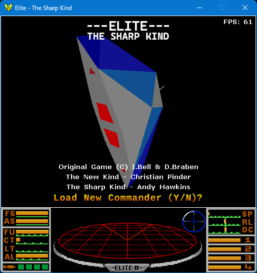

# Elite - The Sharp Kind



A C# port of the classic BBC home computer game 'Elite'.  It is meant to look, feel and play the same as the original 8bit and 16bit versions of the game.

Currently the objective of this port is authenticity, object oriented code and cross platform compatibility using dotnet.
Framerate is fixed at 13.5 fps, which using the current engine implementation, runs at approximately the same speed as the original.
Performance, or maximum FPS, are a secondary objective, which may come later.

Part of [The Sharp Kind](../README.md), alongside [Stunt Car Racer - The Sharp Kind](scr-readme.md).

## Getting Started

The program has been tested to run on the following platforms and architectures:
- Windows 10 (x64)
- Ubuntu 24.04 (x64)
- Raspberry Pi 4 (ARM64)

To build and run from source, install the .NET SDK and run:

``` bash
dotnet run --project src/elite/apps/EliteSharp
```

It can also be run and debugged directly from an IDE: open [TheSharpKind.slnx](../TheSharpKind.slnx) in Visual Studio and set `EliteSharp` as the startup project, or open the repo root in VS Code and use the "Elite" launch configuration (`.vscode/launch.json`).

CI also publishes self-contained single-file builds (win-x64 and linux-x64) that do not require the .NET runtime to be installed.

## Controls

Press Y or N on the intro screen
Press Space on the ship parade screen
Use Left/Right cursor keys to scroll through ships on the ship parade screen

| Key | Function |
| --- | -------- |
| F1  | Front View (in flight) <br/> Launch (when docked) |
| F2  | Rear View |
| F3  | Left View |
| F4  | Right View (in flight) <br/> Equip ship (when docked) |
| F5 | Display Galactic Chart |
| F6 | Short Range Chart |
| F7 | Show information on selected planet |
| F8 | Stock market |
| F9 | Commander information |
| F10 | Inventory |
| F11 | Options |
| P | Pause game |
| R | Resume game |

### Flight Controls
| Key | Function |
| --- | -------- |
| A | Fire lasers |
| S or Up Arrow | Dive |
| X or Down Arrow | Climb |
| &lt; or Left Arrow | Roll Left |
| &gt; or Right Arrow | Roll Right |
| / | Slow Down |
| Space | Speed up |
| C | Activate docking computer, if fitted |
| D | De-activate docking computer if switched on |
| E | Active ECM, if fitted |
| H | Hyperspace |
| J | Warp Jump |
| M | Fire missile |
| T | Target a missile |
| U | Un-target missile |
| TAB | Detonate energy bomb, if fitted |
| CTRL+H | Galactic Hyperspace, if fitted |
| ESC | Launch escape capsule, if fitted |

### Chart Screens
| Key | Function |
| --- | -------- |
| D | Select a planet and show distance to it |
| F | Find planet by name |
| O | Return cursor to current planet |
| Cursor Keys | Move cross hairs around |

### Equipment Screen
| Key | Function |
| --- | -------- |
| Arrow keys | Navigate options |
| Enter | Buy item |

### Stock Market
| Key | Function |
| --- | -------- |
| S or Up Arrow | Select previous item |
| X or Down Arrow | Select next item |
| &lt; or Left Arrow | Sell item |
| &gt; or Right Arrow | Buy item |

### Options Screen
| Key | Function |
| --- | -------- |
| Arrow keys | Navigate options |
| Enter | Change option |

### Settings Screens
There are two, matching the two halves of the config file. Both are reached from the Options Screen (F11). Use the cursor keys to select a setting and Enter/Return to change it; every change takes effect immediately and is saved as it is made, so there is no save step.

- **Game Settings** — how Elite itself looks and plays: planet style, sun style, planet descriptions and instant docking.
- **Engine Settings** — the settings shared by every game in the collection: graphic style (wireframe or solid), depth sort, music, sound effects, backend and tier.

The last two are marked `*` on the screen: the backend picks the rendering and audio implementation and the tier picks the asset set and render resolution, and both are read before the game is built, so a change to either is saved now and picked up the next time the game starts.

## Configuration

Game settings are held in the `elite.sharp` file, stored in JSON format, in the user's application data directory (`%AppData%\The Sharp Kind` on Windows, `~/.config/The Sharp Kind` on Linux/macOS) — shared with [Stunt Car Racer - The Sharp Kind](scr-readme.md). Commander saves (`.cmdr` files) and logs (`logs\elite-*.log`, daily rolling, 7 days retained) live in the same directory. If the config file is missing or invalid the game falls back to defaults.

The file's `engine` element holds the settings shared by every game — the backend, the tier, the frame rate and the graphic style among them — and is documented in the [main readme](../README.md#configuration). Elite's own settings sit alongside it under `game`, and can take the following values:

``` json
{
    "game": {
        "planetStyle": "Fractal",              // The render style of the filled planets (ignored when the engine's graphicStyle is Wireframe).  Solid or Striped or Fractal
        "sunStyle": "Gradient",                // The render style of the filled sun (ignored when the engine's graphicStyle is Wireframe).  Solid or Gradient
        "planetDescriptions": "TreeGrubs",     // Description style used for the planets.  TreeGrubs (BBC) or HoopyCasinos (MSX)
        "instantDock": false                   // When the docking computer is engaged, instantly dock (true) or let the auto pilot fly in (false)
    }
}
```

The Game Settings screen changes all of these live, and the engine's graphic style with them; every change is saved as it is made.

## Credits

'Elite - The Sharp Kind' re-engineered in C# by Andy Hawkins 2023.
- Converted into C#/.NET from C.J.Pinder's C version.
- Forked from fesh0r/newkind 06 Dec 2022

'Elite - The New Kind' re-engineered in C by C.J.Pinder 1999-2001.
- christian@newkind.co.uk  |  www.newkind.co.uk
- Reverse engineered from the BBC disk version of Elite.
- Additional material by C.J.Pinder.
- Face information for the ships. Adapted from the Elite ship data published by Ian Bell.
- Alterations to vertex ordering by Thomas Harte. <T.Harte@excite.com>
- Routines for drawing anti-aliased lines and circles by T.Harte.
- Check for hidden surface supplied by T.Harte.

The original Elite code is (C) I.Bell & D.Braben 1984.

Gabriel Gambetta - Computer Graphics from Scratch
https://gabrielgambetta.com/computer-graphics-from-scratch/
